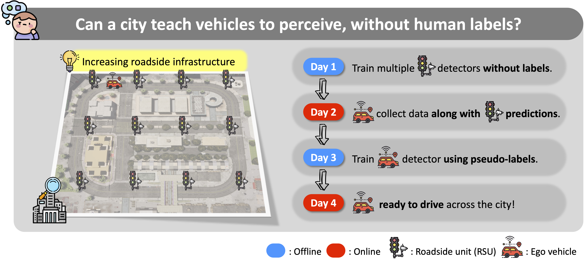

<h1 style="font-size: 100 pt;" align=center><strong>When the City Teaches the Car:
Label-Free 3D Perception from Infrastructure</strong></h1>

📖 <a href="https://arxiv.org/abs/2603.16742">Paper</a> |
📋 <a href="https://jinsuyoo.info/civet/">Project page</a>

## To Do

- [ ] Data generation
- [ ] Training code
- [ ] Dataset release

## Data Generation

## Training

## Acknowledgments

This work builds upon the following repositories:

- [Carla leaderboard](https://github.com/carla-simulator/leaderboard)
- [V2Xverse](https://github.com/CollaborativePerception/V2Xverse)
